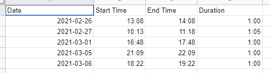
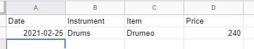
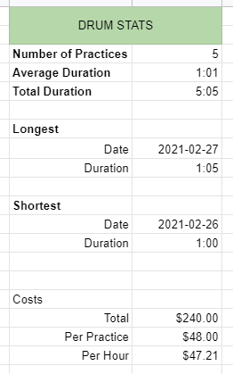

## What is this project about

The goal for this project is to create a website in which a person can perform the following actions

- Log in to environment that show them their own practices, instruments, costs, and stats.
- Allows them to add a practice, consisting of the following fields
	- Date
	- Duration
	- Instrument
	- Notes about the practice
- Allows them to add a new instrument, consisting of the following fields
	- Type of Instrument
	- Brand Name
	- Model Name
	- Serial Number (optional)
	- Nickname (optional)
	- Photo (maybe not version 1)
	- Notes
- Allows them to add a cost, consisting of the following fields
	- Date
	- Amount
	- Instrument it relates to
	- Notes
- Using the above data, it would be cool to calculate stats. The initial ideas are
	- Average Duration
	- Longest/Shortest Practice
	- Cost Per Hour
	- Cost Per Practice

I've mocked this out a bit using Google Sheets. Here's a couple images. The first one is the practice page, the second is the cost page, the third one is the stats page.

### Technical Aspects
From the technical side of things, I want to have interactions with an online database. First idea would be Firebase, which would allow the site to authenticate with Google. Then I don't have to deal with passwords/security directly. Also it allows me to mess with the data management.